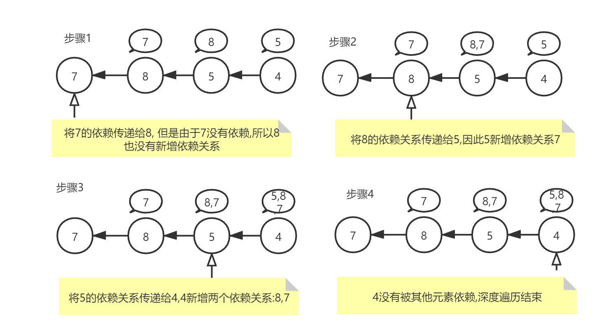
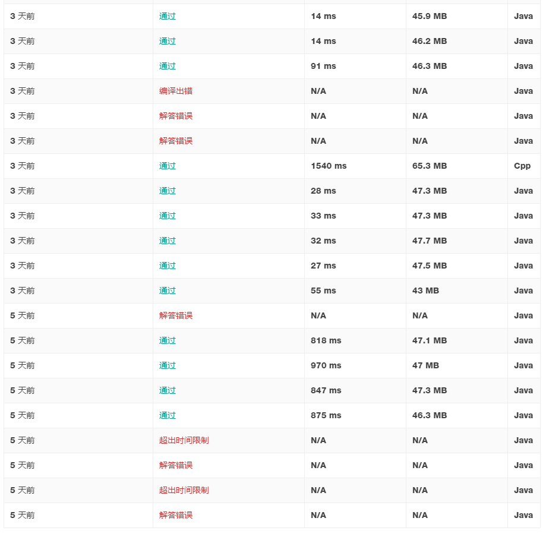

# 1462. 课程安排 IV

## 思路

这道题最先想到的反而是最后的步骤 , 把课程之间的依赖关系使用矩阵表示 ,即`boolean[i][j]`表示i是否是j的先修课程; 初始的时候把现有的关系在矩阵上表达出来 , 之后不断把父节点的依赖传递给儿子 ,这其实就是树的遍历. 同时, 为了降低时间复杂度我又引入了两个数组链表(` LinkedList<Integer>[]`) , 分别包含了每个元素的父亲节点和儿子节点.假设7是8的先修,8是5的先修,5是4的先修 , 遍历的步骤则如下: 



按照这个思路 , 我的初版代码就提交了:

```java
public static List<Boolean> checkIfPrerequisite(int n, int[][] prerequisites, int[][] queries) {
    boolean[][] depend = new boolean[n][n];
    // children[i] 里面的是i的孩子
    LinkedList<Integer>[] children = new LinkedList[n];
    // parent[i] 是其父亲
    LinkedList<Integer>[] parents = new LinkedList[n];
    for (int i = 0; i < children.length; i++) {
        children[i] = new LinkedList<>();
        parents[i] = new LinkedList<>();
    }  
    for (int[] prerequisite : prerequisites) {
        depend[prerequisite[0]][prerequisite[1]] = true;
        children[prerequisite[0]].add(prerequisite[1]);
        parents[prerequisite[1]].add(prerequisite[0]);
    }
    // 其实代码这里是从第一层开始遍历的,而非上图所示的根遍历, 同时这里使用了set避免有重复元素
    HashSet<Integer> set = new HashSet<>();
    for (int i = 0; i < n; i++) {
        if (parents[i].isEmpty()) {
            for (Integer integer : children[i]) {
                set.addAll(children[integer]);
            }
        }
    }
    set.remove(null);
    // 这种一边入,一边出的肯定就是使用链表了
    LinkedList<Integer> deque = new LinkedList<>(set);
    while (!deque.isEmpty()) {
        Integer i = deque.removeFirst();
        LinkedList<Integer> grandParents = new LinkedList<>();
        for (Integer parent : parents[i]) {
            for (Integer grandParent : parents[parent]) {
                grandParents.add(grandParent);
                depend[grandParent][i] = true;
            }
        }
        parents[i].addAll(grandParents);
        deque.addAll(children[i]);
    }
    ArrayList<Boolean> booleans = new ArrayList<>();
    for (int[] query : queries) {
        booleans.add(depend[query[0]][query[1]]);
    }
    return booleans;
}
```

但是理想很丰满 , 现实很骨感 , 提交之后就超时了 , 我把测试用例([[3,9],[3,2],[3,7],[9,5],[9,0],[9,6],[8,0],[8,1],[8,7],[5,0],[5,2],[5,1],[5,7],[5,6],[0,2],[0,1],[0,6],[2,1],[2,6],[4,1],[1,7],[1,6],[7,6]])拿到本地测试 , 也跑了2.8s+ , 思考下没想到哪里出问题了, 所有就在while后面增加了一行打印`System.out.println(deque);` , 输出如下:

```
[0, 1, 2, 5, 6, 7]
[1, 2, 5, 6, 7, 2, 1, 6]
[2, 5, 6, 7, 2, 1, 6, 7, 6]
[5, 6, 7, 2, 1, 6, 7, 6, 1, 6]
[6, 7, 2, 1, 6, 7, 6, 1, 6, 0, 2, 1, 7, 6]
[7, 2, 1, 6, 7, 6, 1, 6, 0, 2, 1, 7, 6]
[2, 1, 6, 7, 6, 1, 6, 0, 2, 1, 7, 6, 6]
[1, 6, 7, 6, 1, 6, 0, 2, 1, 7, 6, 6, 1, 6]
[6, 7, 6, 1, 6, 0, 2, 1, 7, 6, 6, 1, 6, 7, 6]
[7, 6, 1, 6, 0, 2, 1, 7, 6, 6, 1, 6, 7, 6]
[6, 1, 6, 0, 2, 1, 7, 6, 6, 1, 6, 7, 6, 6]
[1, 6, 0, 2, 1, 7, 6, 6, 1, 6, 7, 6, 6]
[6, 0, 2, 1, 7, 6, 6, 1, 6, 7, 6, 6, 7, 6]
[0, 2, 1, 7, 6, 6, 1, 6, 7, 6, 6, 7, 6]
[2, 1, 7, 6, 6, 1, 6, 7, 6, 6, 7, 6, 2, 1, 6]
[1, 7, 6, 6, 1, 6, 7, 6, 6, 7, 6, 2, 1, 6, 1, 6]
[7, 6, 6, 1, 6, 7, 6, 6, 7, 6, 2, 1, 6, 1, 6, 7, 6]
[6, 6, 1, 6, 7, 6, 6, 7, 6, 2, 1, 6, 1, 6, 7, 6, 6]
[6, 1, 6, 7, 6, 6, 7, 6, 2, 1, 6, 1, 6, 7, 6, 6]
[1, 6, 7, 6, 6, 7, 6, 2, 1, 6, 1, 6, 7, 6, 6]
[6, 7, 6, 6, 7, 6, 2, 1, 6, 1, 6, 7, 6, 6, 7, 6]
[7, 6, 6, 7, 6, 2, 1, 6, 1, 6, 7, 6, 6, 7, 6]
[6, 6, 7, 6, 2, 1, 6, 1, 6, 7, 6, 6, 7, 6, 6]
[6, 7, 6, 2, 1, 6, 1, 6, 7, 6, 6, 7, 6, 6]
[7, 6, 2, 1, 6, 1, 6, 7, 6, 6, 7, 6, 6]
[6, 2, 1, 6, 1, 6, 7, 6, 6, 7, 6, 6, 6]
[2, 1, 6, 1, 6, 7, 6, 6, 7, 6, 6, 6]
[1, 6, 1, 6, 7, 6, 6, 7, 6, 6, 6, 1, 6]
[6, 1, 6, 7, 6, 6, 7, 6, 6, 6, 1, 6, 7, 6]
[1, 6, 7, 6, 6, 7, 6, 6, 6, 1, 6, 7, 6]
[6, 7, 6, 6, 7, 6, 6, 6, 1, 6, 7, 6, 7, 6]
[7, 6, 6, 7, 6, 6, 6, 1, 6, 7, 6, 7, 6]
[6, 6, 7, 6, 6, 6, 1, 6, 7, 6, 7, 6, 6]
[6, 7, 6, 6, 6, 1, 6, 7, 6, 7, 6, 6]
[7, 6, 6, 6, 1, 6, 7, 6, 7, 6, 6]
[6, 6, 6, 1, 6, 7, 6, 7, 6, 6, 6]
[6, 6, 1, 6, 7, 6, 7, 6, 6, 6]
[6, 1, 6, 7, 6, 7, 6, 6, 6]
[1, 6, 7, 6, 7, 6, 6, 6]
[6, 7, 6, 7, 6, 6, 6, 7, 6]
[7, 6, 7, 6, 6, 6, 7, 6]
[6, 7, 6, 6, 6, 7, 6, 6]
[7, 6, 6, 6, 7, 6, 6]
[6, 6, 6, 7, 6, 6, 6]
[6, 6, 7, 6, 6, 6]
[6, 7, 6, 6, 6]
[7, 6, 6, 6]
[6, 6, 6, 6]
[6, 6, 6]
[6, 6]
[6]
```

看了下输出就明白了原因 , 我上图所绘画的是理想情况下遍历 , 但是实际上一门课程有可能有多门先修课 , 这就有了一个缺点:同一个点有可能被遍历多次并且进而造成`parents`中的链表产生重复数据 . 

最先想到的是在removeFirst 下面新增一个判断 `if (deque.contains(i)) continue;`  ,即链表里面有该数据 , 则跳过本次.但是很不幸依旧超时, 想了下刚才的判断发现其实还有优化空间 : 如果矩阵中已经有依赖关系了 , 就不再往`parents`链表中新增数据 , 改动后的while核心代码块如下:

```java
while (!deque.isEmpty()) {
    Integer i = deque.removeFirst();
    LinkedList<Integer> grandParents = new LinkedList<>();
    for (Integer parent : parents[i]) {
        for (Integer grandParent : parents[parent]) {
            if (!depend[grandParent][i]) {
                grandParents.add(grandParent);
                depend[grandParent][i] = true;
            }
        }
    }
    parents[i].addAll(grandParents);
    deque.addAll(children[i].stream().filter(x -> !deque.contains(x)).collect(Collectors.toList()));
}
```

提交之后终于不超时了 , 又前前后后小改动了一些 , 但其实作用都不大在900ms左右. 并不算很满意

之后在评论里面看到了Floyd . 想到了这个求最短路径的算法, 心想也肯定适配于这道题. Floyd算法比较简洁, 就几行代码, O(n³)的复杂度 , 但是需要注意的是最外层的点是中专点 ,  几个点的顺序不能错. 提交之后耗时就瞬间拉了下来 ,只有55ms.

## 后续优化

按理来说 , 使用Floyd之后已经皆大欢喜了 .  但是我又想到了一种思路避免重复经过一个点 , 计算每个点的当前父亲节点的数量 , 当为0的时候把他的依赖关系传递给儿子节点 , 并且把儿子的父亲节点数量减少1 .其实这种思路就是当一个节点没有父亲节点时 就把这个节点从树中拿出来.代码如下:

```java
public List<Boolean> checkIfPrerequisite(int n, int[][] prerequisites, int[][] queries) {
    boolean[][] depend = new boolean[n][n];
    // children[i] 里面的是i的孩子
    LinkedList<Integer>[] children = new LinkedList[n];
    // parent[i] 是其父亲
    LinkedList<Integer>[] parents = new LinkedList[n];
    for (int i = 0; i < n; i++) {
        children[i] = new LinkedList<>();
        parents[i] = new LinkedList<>();
    }
    int[] parentsCounts = new int[n];
    for (int[] prerequisite : prerequisites) {
        depend[prerequisite[0]][prerequisite[1]] = true;
        children[prerequisite[0]].add(prerequisite[1]);
        parents[prerequisite[1]].add(prerequisite[0]);
        parentsCounts[prerequisite[1]]++;
    }
    boolean flag;
    do {
        flag = false;
        for (int i = 0; i < n; i++) {
            if (parentsCounts[i] == 0) {
                flag = true;
                for (Integer child : children[i]) {
                    for (Integer grandParents : parents[i]) {
                        if (!depend[grandParents][child]) {
                            depend[grandParents][child] = true;
                            parents[child].add(grandParents);
                        }
                    }
                    parentsCounts[child]--;
                }
                parentsCounts[i]--;
            }
        }
    } while (flag);
    ArrayList<Boolean> booleans = new ArrayList<>();
    for (int[] query : queries) {
        booleans.add(depend[query[0]][query[1]]);
    }
    return booleans;
}
```

果然不负众望, 耗时降低到了27ms ,88% .想了下感觉还有优化空间 , 越往后面走 , parents越饱和 ,因此可能直接使用depend效率应该也不错 , 修改后的代码如下:

```java
public List<Boolean> checkIfPrerequisite(int n, int[][] prerequisites, int[][] queries) {
    boolean[][] depend = new boolean[n][n];
    // children[i] 里面的是i的孩子
    LinkedList<Integer>[] children = new LinkedList[n];
    // parent[i] 是其父亲
    for (int i = 0; i < n; i++) {
        children[i] = new LinkedList<>();
    }
    // 每个节点有几个父亲
    int[] parentsCounts = new int[n];
    for (int[] prerequisite : prerequisites) {
        depend[prerequisite[0]][prerequisite[1]] = true;
        children[prerequisite[0]].add(prerequisite[1]);
        parentsCounts[prerequisite[1]]++;
    }
    boolean flag;
    do {
        flag = false;
        for (int i = 0; i < n; i++) {
            if (parentsCounts[i] == 0) {
                flag = true;
                for (Integer child : children[i]) {
                    for (int j = 0; j < n; j++) {
                        if (depend[j][i]) {
                            depend[j][child] = true;
                        }
                    }
                    parentsCounts[child]--;
                }
                // 从0变成-1
                parentsCounts[i]--;
            }
        }
    } while (flag);
    ArrayList<Boolean> booleans = new ArrayList<>();
    for (int[] query : queries) {
        booleans.add(depend[query[0]][query[1]]);
    }
    return booleans;
}
```

提交之后 ,果然很不错14ms 94% , 考虑到部分人的答案是漏网之鱼 , 不能通过题意下其他case .我这个答案应该是比较优秀的了 🎉

## 总结

这道题我前前后后思考了很久 ,也算是颇费一番心思 , 最早的时候用的是广度遍历 . 但是图的广度遍历没办法确保路径不重复 , 之后又复习了一遍Floyd算法 .但是从耗时上来看针对这道题Flody算法也并不太适合, 所以我也继续寻找更优解 , 和[287. 寻找重复数](../287. 寻找重复数/README.md)经历的过程类似 , 突然又想起了之前的一个知识点 ,拓扑排序 甚至我当时自己都没意识到这一点 , 另外拓扑排序也可以用来判断图中是否有环 .另外用矩阵和用数组链表的表达到达关系是很常见的, 并且有正式的名字,分别叫做邻接矩阵和邻接链表 , 当时我还以为自己创造了这些结构. 最后截图一张提交记录,记录下自己艰辛的刷题之旅



* [Floyd算法](https://zhuanlan.zhihu.com/p/72248451) 
* [拓扑排序的实现方法以及环路检测](https://zhuanlan.zhihu.com/p/34871092)
* [邻接矩阵](https://zh.wikipedia.org/wiki/%E9%82%BB%E6%8E%A5%E7%9F%A9%E9%98%B5)
* [邻接表](https://zh.wikipedia.org/wiki/%E9%82%BB%E6%8E%A5%E8%A1%A8)