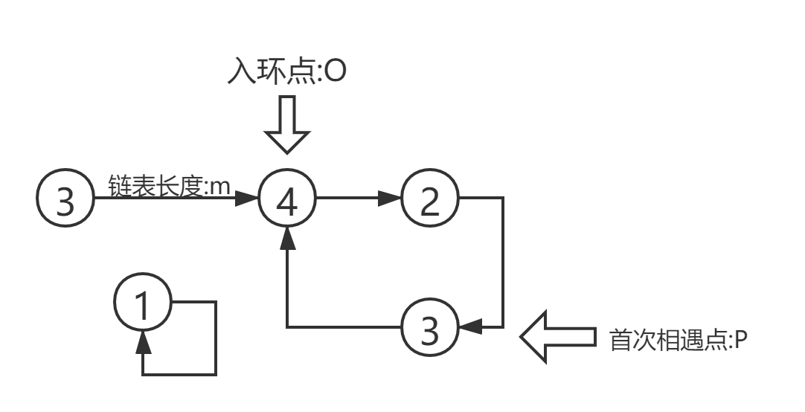
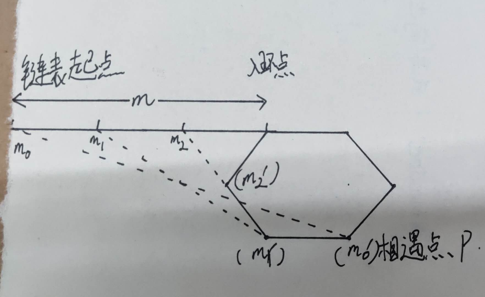
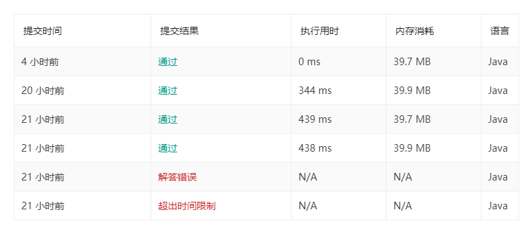

# 287. 寻找重复数

总结这道题之前可以讲一些小故事 :

* 刚毕业的时候 , 碰到一个学长 , 校招进去了滴滴 , 闲聊到技术 ,他问我怎么判断链表有没有环 . 我那个时候还没有算法的概念 , 自然也就不懂这些 , 但是他说的答案我却记住了 :  一个指针每次走一步 , 另外一个指针每次走两步, 如果相遇了就说明有环
* 又有一次 , 和一个大牛聊到算法 , 考了我另外一个问题 , 范围在[1,m]的m+1个数 , 分散在m+1的数组中, 其中有且仅有一个重复 , 怎么快速的找到重复的数据 . 我再次挠头 , 不过我又记住了答案 : 把每个数诺回到自己的位置 ,重复的数据会发生碰撞
* 大概去年的时候 , 有想了解算法的念头 , 学了些最基础的dp , 比如用不同面额的纸币凑指定金额 . 恰好朋友买了一本`漫画算法：小灰的算法之旅` , 中间有分析从链表进入环的情况 . 仔细阅读了几遍 , 发现其中的证明并不严谨 , 加了作者微信之后得知已经发现问题 , 下一版修正 . 有些得意吧 , 所以也没认真的分析情况 , 一些概念也就一扫而过 , 证明也没有自己推断一遍
* 再然后就是今天了 , 看到题目之后第一时间就想到把各个元素归位 , 但是也只能判断是否出现了环 , 并不能找到确切的重复元素 .再然后想着能不能用位运算或者累加判断 ,也没有思路 . 所以先放弃了. 尝试使用n平方复杂度的判断 , 虽然AC了 , 但也落后于95% , 心有不甘 重新开始整理思路 :
  * 位运算或累加基本上对我来说基本上走不通 , 基础太薄弱
  * 感觉链表入环问题 还有好多不清晰的地方 , 因此这个方向继续琢磨
* 琢磨链表入环问题发现了很多细节 , 比如怎么求环长度 , 几个变量的关系 . 最后把这道题简化为了如何求入环点. 然后不知怎么 ,感觉灵感突然一来. 就想起了那本上证明有瑕疵 , 但是结果正确的结论

## 解题思路

最初的想法比较简单 , 先把链表中的各个元素还原到与其指相符的位置 即a[i]=i , 如 [3,1,1,4,2]还原成[X,1,2,3,4] 以及重复的一个1 . 但是由于这道题并不允许修改原数组所以实际上的遍历过程如下: 

```
a[0]=3
a[0]!=0
a[3]=4
a[3]!=3
a[4]=2
a[4]!=4
a[2]=1
a[2]!=2
a[1]=1  ✔
```

因此 ,得出1是重复元素 ; 但是这种方法存在局限性 , 如果数组换成 [3,1,3,4,2] , 则最终落入由 3-4-2组成的环. 最早的时候没想太多 ,碰到环了跳出来就好了. 方法也比较粗暴 , 从本次起点开始 ,如果总步长大于m就说明有环 . 再之后突然想到了利用快慢指针 , 即前文提到的一个指针每次一步 , 一个指针每次走两步 . 相遇即说明存在环 , 尝试画图 ,如下:



可以定义4为当前结构的入环点 , 并且由于4被两个元素指向 且a[3]=4 , 因此得知 3为重复元素 . 那么这道题可以简化为求入环点的下标.

设置一下变量:

对于这个数组 , 快慢指针第一次相遇是在环中的3即P点 .设此时慢指针走过的长度为s , 从O到P的距离为 p , 从链表头部到入环点的距离为m, 设环长度为c.

易知 s=m+p ,即从起点开始走过s长度会到达点P , 由于快指针在P点上与慢指针相遇 , 所以从起点走过2s依旧会在点P上 ,所以可知 s%c=0 即 

```
(m+p)%c=0 //p肯定小于c ,并且我们假定P与O不重合
m%c+p=c
m%c=c-p // c-p 则为 P点到O点距离 
由于链表入口到入环点的长度为m , 而点P到点O的距离为c-p
```

由上可知 ,如果此时两个指针 ,一个从链表头部出发 ,一个从点P出发 , 每次步进为1 , 则肯定在入环点相遇(到这里有点绕 ,可以多画图想想)  另外这种情况也对P,O重合的场景适用 , 由此可写出代码

```java
public static int findDuplicate(int[] nums) {
    for (int i = 0; i < nums.length; i++) {
        if (nums[i] == i) {
            continue;
        }
        int slowIndex = nums[i], fastIndex = nums[nums[i]];
        while (slowIndex != fastIndex) {
            slowIndex = nums[slowIndex];
            fastIndex = nums[nums[fastIndex]];
        }
        if (slowIndex == i) {
            continue;
        }
        if (slowIndex == nums[slowIndex]) {
            return slowIndex;
        }
        slowIndex = i;
        while (slowIndex != fastIndex) {
            slowIndex = nums[slowIndex];
            fastIndex = nums[fastIndex];
        }
        return slowIndex;
    }
    return -1;
}
```

但是这个题目的知识点还未结束 : 

* 第一次相遇点有什么特殊吗:

  如果把链表附到环上 , 第一次相遇点其实和 链表的开始是重合的 ,证明 也很简单 , 可以用上文中提到的 s%c=0


   

* 如何求环的长度:

  到达P点的时候让快慢指针继续走 ,等到下次相遇慢指针走过的距离就是 环长度c

## 代码对比

```java
class Solution {
    public int findDuplicate(int[] nums) {
        int slow = 0, fast = 0;
        do {
            slow = nums[slow];
            fast = nums[nums[fast]];
        } while (slow != fast);
        slow = 0;
        while (slow != fast) {
            slow = nums[slow];
            fast = nums[fast];
        }
        return slow;
    }
}
```

仔细来看 我的代码比官方代码罗嗦了很多 , 因为最早的时候 我下意识使用了a[0]=1这种匹配规则 ,虽然后来有意识到a[1]=1进行匹配更简单 , 但是部分逻辑已经没有再次优化 .另外 这段代码使用do while进行开满指针 赛跑 , 我则是使用了while do , 又啰嗦了一下. 最后的时候 我是判断有没有环 ,如果没有 就直接跳出 ,而上述代码是把两种情况合并了 , 我觉得这里还是尽量分开 .增加代码可读性

## 总结

其实 ,技术真的是要靠不断积累的 , 这个题 也把好多我之前遇到的知识点都串在一起了 . 另外还有一点就是 , 千万不要眼高手低 ,改自己动手总结一定要自己动手. 推断入环点的时候 ,我思考了至少 4,5个小时 ,如果当初我读那本书再多较真一些 也会轻松很多 .不过 最后结局还是好的 自己实现了AC



## 关联题目

*  [141. 环形链表](https://leetcode-cn.com/problems/linked-list-cycle/)

* [142. 环形链表 II](https://leetcode-cn.com/problems/linked-list-cycle-ii/solution/huan-xing-lian-biao-ii-by-leetcode/)